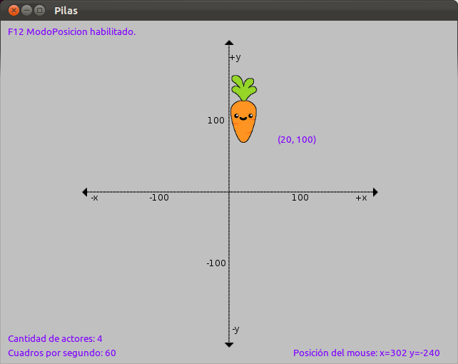

============
Escena juego
============

Clases de actores
-----------------

Vamos a empezar creando los actores con sus distintas propiedades y habilidades, para eso vamos a crear un archivo aparte llamado "actores.py". Dentro de él haremos una clase para cada actor.

Un ejemplo de clase para un actor sería: 

.. code-block:: python
    :linenos:
    
    class Zanahoria(pilas.actores.Zanahoria):
        def __init__(self, x=0, y=0): 
            pilas.actores.Zanahoria.__init__(self, x=x, y=y)
            self.aprender(pilas.habilidades.Arrastrable)

    Zanahoria(20, 100)
    
Esto quedaría así:

Conociendo como es el sistema para definir actores en clases, continuamos con el código del "Pong".

Para la pelota del juego decidimos usar una bomba ("pilas.actores.Bomba()"), que explota al ganar uno de los dos jugadores:

.. code-block:: python
    :linenos:
    
    class Pelota(pilas.actores.Bomba):      # representa la pelota del juego
        def __init__(self, x=0, y=0):
            pilas.actores.Bomba.__init__(self, x=x, y=y)
            self.circulo(x, y) = pilas.fisica.Circulo(x, y, 20, restitucion=1, friccion=0, amortiguacion=0)   # creamos un circulo de fisica con sus propiedades
            self.imitar(self.circulo)      # hacemos que la pelota siga los movimientos del circulo de fisica
            self.dx = 1      # creamos coeficiente de impulso para x
            self.dy = 1      # creamos coeficiente de impulso para y
            self.circulo.impulsar(self.dx * 50000, self.dy * 50000)      # impulsamos por primera vez la pelota para que arranque el juego

Los actores que usaremos en nuestro programa serán:

#. Jugador 1
#. Jugador 2
#. Puntajes
#. Pelota
 
Teniendo ya creada la pelota del juego, continuaremos con los jugadores. Las imágenes usadas para la creación de los mismos son:

======================================  ======================================
.. image:: imagenes/pilas-BaseRoja.bmp  .. image:: imagenes/pilas-BaseAzul.bmp
======================================  ======================================

Comenzando con el jugador 1, haremos:

.. code-block:: python
    :linenos:

    class Jugador1(pilas.actores.Actor):      # definimos la clase del jugador 1
        def __init__(self, x=0, y=0):
            pilas.actores.Actor.__init__(self, x=x, y=y)
            self.imagen = pilas.imagenes.cargar('BaseRoja.bmp')      # le cargamos la imagen
            self.radio_de_colision = 15      # le asignamos el radio de colision al actor
            self.aprender(pilas.habilidades.SeMantieneEnPantalla)      # le enseñamos a mantenerse en pantalla con esta habilidad
            self.aprender(self.MoverseConWS)      # le enseñamos a moverse con W y S, con una habilidad creada por nosotros (explicada mas adelante) dentro de la clase Jugador1

Basicamente, lo que hicimos fue cargar una imagen (llamada "BaseRoja.bmp" en este caso), asignarle un radio de colisión, obligarlo a mantenerse en pantalla y brindarle movimiento con las teclas W y S.

Para el jugador 2 es basicamente lo mismo, salvo que en vez de aprender a moverse con W y S, se mueve con las teclas Arriba y Abajo.

A continuación les mostramos el código:

.. code-block:: python
    :linenos:

    class Jugador2(pilas.actores.Actor):      # definimos la clase del jugador 2
        def __init__(self, x=0, y=0):
            pilas.actores.Actor.__init__(self, x=x, y=y)
            self.imagen = pilas.imagenes.cargar('BaseAzul.bmp')      # le cargamos la imagen
            self.radio_de_colision = 15      # le asignamos el radio de colision al actor
            self.aprender(pilas.habilidades.SeMantieneEnPantalla)      # le enseñamos a mantenerse en pantalla con esta habilidad
            self.aprender(self.MoverseConArribaAbajo)      # le enseñamos a moverse con las teclas arriba y abajo (habilidad definida por nosotros)

        class MoverseConArribaAbajo(pilas.habilidades.Habilidad):      # esta clase define la habilidad llamada anteriormente
            def __init__(self, receptor):
                pilas.habilidades.Habilidad.__init__(self, receptor)
                pilas.eventos.actualizar.conectar(self.pulsa_tecla)      # le decimos que actualice la funcion self.pulsa_tecla
       
            def pulsa_tecla(self, evento):
                velocidad = 5 
                c = pilas.mundo.control

                if c.arriba:    # si se ha pulsado arriba
                    self.receptor.y += velocidad     # movemos al receptor (actor) para arriba
                if c.abajo:     # si se ha pulsado abajo
                    self.receptor.y -= velocidad     # movemos al receptor (actor) para abajo

Por último, necesitamos puntajes, para esto deberán definir dos clases muy simples:

.. code-block:: python
    :linenos:

    class Puntaje1(pilas.actores.Puntaje):      # definimos la clase del puntaje 1
        def __init__(self, x=-70, y=220):
            pilas.actores.Puntaje.__init__(self, x=x, y=y)
            self.color = pilas.colores.blanco      # le cargamos el color

    class Puntaje2(pilas.actores.Puntaje):      # definimos la clase del puntaje 2 
        def __init__(self, x=70, y=220):
            pilas.actores.Puntaje.__init__(self, x=x, y=y) 
            self.color = pilas.colores.blanco      # le cargamos el color

Habilidades
-----------

.. topic:: Habilidad:
    
    **Una habilidad** tambien **es una clase**, que está aplicada a un actor, y que no se ve por si sola.

    **La habilidad le enseña comportamientos al actor para diferenciarse de otros de su misma especie**.

Por ejemplo, si creamos un mono llamado mono y le enseñamos la habilidad "pilas.habilidades.Arrastrable":

.. code-block:: python
    :linenos:

    mono = pilas.actores.Mono()      # creamos al mono
    mono.aprender(pilas.habilidades.Arrastrable)     # le enseñamos que sea arrastrable

Este mono será distinto a los demás ya que se puede arrastrar con el mouse, en este caso la habilidad que usamos ya estaba creada en pilas, pero si queremos que un actor haga cosas diferentes y no encontramos una habilidad adecuada, podemos crear nuestras propias habilidades.

Para crear habilidades, lo único que hay que tener en cuenta es que la clase no va a ser de tipo "pilas.actores.Actor", ni "pilas.escenas.Escena", sino que va a ser una habilidad de tipo "pilas.habilidades.Habilidad".

Comencemos con el jugador 1 o jugador rojo, para crearlo necesitamos crear una nueva habilidad que le va a enseñar a nuestro actor a moverse con las teclas ``<W>`` y ``<S>``, para ir arriba y abajo.

A continuación veremos un ejemplo sencillo de habilidad creada por nosotros y aplicable a nuestro programa, la cual **debe estar definida dentro de la clase Jugador1**:

.. code-block:: python
    :linenos:

    from pilas.simbolos import *

    class MoverseConWS(pilas.habilidades.Habilidad):      # definimos la habilidad para que se mueva con W y S
        def __init__(self, receptor):      # ademas de su clase necesita saber cual es su receptor (el actor)
            pilas.habilidades.Habilidad.__init__(self, receptor)
            self.w = False      # esta variable sera True cuando se pulse la tecla w
            self.s = False      # esta variable sera True cuando se pulse la tecla s
            pilas.eventos.actualizar.conectar(self.pulsa_tecla)      # le decimos que actualice 'pulsa_tecla'
            pilas.eventos.pulsa_tecla.conectar(self.cuando_pulsa_la_tecla)
            pilas.eventos.suelta_tecla.conectar(self.cuando_suelta_la_tecla)
   
        def pulsa_tecla(self, evento):      # esta funcion mueve el actor para arriba (si pulso w) o abajo (si pulso s)
            velocidad = 5
            if self.w:
                self.receptor.y += velocidad
            elif self.s:
                self.receptor.y -= velocidad

        def cuando_pulsa_la_tecla(self, evento):      # detecta si pulso una tecla y cambia el estado de las variables
            self.procesar_cambio_de_estado_en_la_tecla(evento.codigo, True)

        def cuando_suelta_la_tecla(self, evento):      # detecta si solto una tecla y cambia el estado de las variables
            self.procesar_cambio_de_estado_en_la_tecla(evento.codigo, False) 

        def procesar_cambio_de_estado_en_la_tecla(self, codigo, estado):     # recibe y cambia el estado
            mapa = {w: 'w', s: 's'}
            if mapa.has_key(codigo):
                setattr(self, mapa[codigo], estado)

Bueno, en esta clase podemos encontrar muchas cosas nuevas y que van a parecer difíciles de entender, pero las vamos a ver de nuevo, una por una, para saber como funcionan.

Empecemos con la función "pilas.eventos.actualizar.conectar()". Lo único que hace esta función es recibir otra, definida dentro de la clase (por eso lleva "self." adelante), y ejecutarla constantemente (actualizarla).

Por lo general, se usa para comprobar una condición que cambia su estado (puede ser "True" o "False", en este caso) durante el desarrollo del juego.

Lo que hicimos dentro de esta función que pasamos como parámetro ("self.pulsa_tecla"), fue:

#. Definir una velocidad.
#. Comprobar si se ha pulsado w, si así fue, sumar 5 (la velocidad) a la posición dentro de la coordenada "y" (hacia arriba) del actor (receptor).
#. De lo contrario, si se pulso s, en este caso, restar la velocidad a la posición "y" del actor (para que este vaya hacia abajo)

Para saber si se ha pulsado o soltado una de esas teclas usamos las variables "self.w" y "self.s", pero necesitamos que cambien su estado (valor: "True" o "False"), dependiendo de la interacción del usuario. Para esto, utilizamos la siguiente funciones: "pilas.eventos.pulsa_tecla.conectar()" y"pilas.eventos.suelta_tecla.conectar()"; que como nos dicen sus nombres, detectan la pulsación y despulsación de alguna tecla. 

.. warning:: Hay que saber distinguir entre la función: "self.pulsa_tecla()", **definida por nosotros** en la clase (por eso el "self."); y la otra función totalmente distinta: "pilas.eventos.pulsa_tecla.conectar()", definida en el módulo pilas y **llamada por nosotros**.

Volviendo con las funciones para detectar la pulsación de teclas, las dos tienen algo en común: llaman a otra función (creada por nosotros), "self.procesar_cambio_de_estado_en_la_tecla()", que recibe un codigo (la tecla que se pulsó) y un estado ("True" si se pulsó, "False" si se soltó). Esta función lo que hace es:

#. Crear un mapa con las posibilidades de teclas que se puedan haber pulsado (en este caso solo nesecitamos W y S).
#. Preguntar si el codigo recibido pertenece a alguna opción del mapa ("mapa.has_key(codigo)", ¿mapa contiene una clave <W o S según sea>?).
#. Y por último usa una función de python llamada "setattr()", que recibe tres parámetros y funciona más o menos así:

    .. code-block:: python
        :linenos:
        
        >>> setattr(parametro1, parametro2, parametro3)
        parametro1.parametro2 = parametro3
        
    Lo que hace es simplemente setear atributos, como lo dice el nombre. Se le pasa un 1° parámetro que va a ser la clase, el 2° que va a ser el atributo y el 3° que va ser el valor que se le asigne.

    Para terminar de entenderlo mejor veamos nuestro caso, haciendo de cuenta que la tecla pulsada (si es pulsada la tecla, el estado va a ser "True") fue W:
    
    .. code-block:: python
        :linenos:
        
        >>> setattr(self, mapa[codigo], estado)
        self.w = True

    Ahora se entiende por que declaramos las variables "self.w" y "self.s". Para conocer el estado de cada una en la función "self.pulsa_tecla()".
    
Habiendo creado ya las distintas escenas con sus respectivos fondos y actores. Nuestro juego está casi terminado, solo nos quedaría crear la parte de las colisiones (para que cuando la pelota toque un lado, se sume un punto en el puntaje; y para que a determinada cantidad de puntos explote la bomba y termine el juego).

En este momento nuestro "Pong" se vería así:

.. image:: imagenes/pilas-pong-terminado.gif
    :align: center

Colisiones
----------

La parte de colisiones aun no está desarrollada, este tutorial será actualizado muy pronto.

.. note:: Recuerden que los puntajes deben cambiar su valor a medida que tocan los laterales; así como también, que deben crear una colisión para que la bomba rebote en las dos barras.

Acá se encuentra el código del "Pong" hasta ahora, junto con las imágenes usadas y el archivo "actores.py".

¡Suerte!
