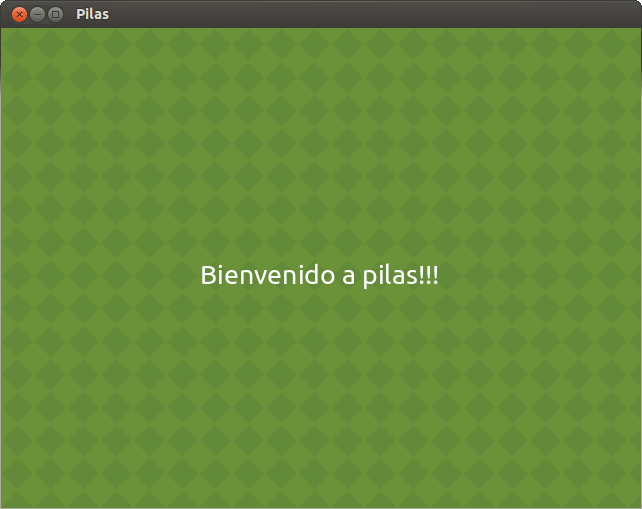
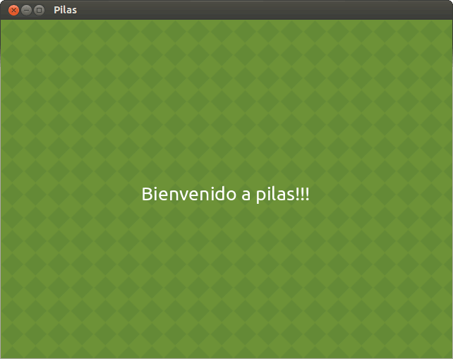
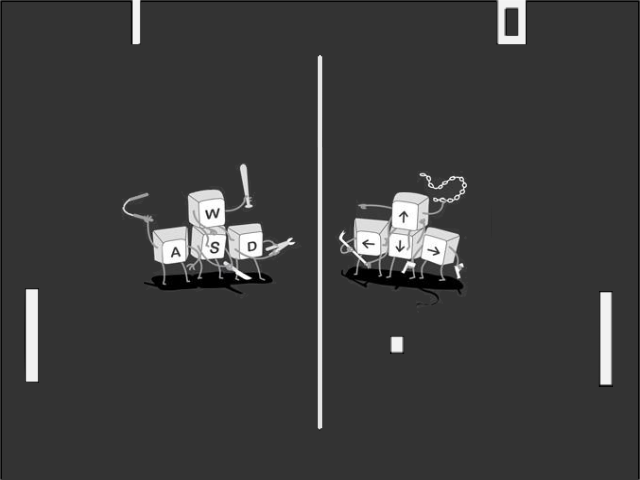
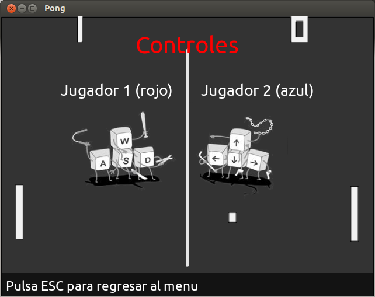

=========================
Escenas: menú y controles
=========================

"Salir"
-------

Ahora que ya tenemos un menú bien hecho podemos seguir con las funciones que implica. Empecemos con la más fácil, "Salir":

.. code-block:: python
    :linenos:
    
    def selecciona_salir():
        pilas.terminar()       # utilizamos esta funcion de pilas para cerrar nuestra ventana
        

Escenas
-------

La siguiente función va a estar destinada a los controles. Para poder hacerla hay que empezar a trabajar con escenas.

.. topic:: Escena:
    
    **Las escenas** en pilas **son las partes de un juego**, cuando termina una escena se borran todos sus actores y comienza una nueva con actores nuevos.

Cuando ponemos pilas.iniciar() se genera una escena llamada Normal, esta escena no tiene un comportamiento muy elaborado, simplemente imprime toda la pantalla de gris para que podamos colocar actores sobre ella y veamos una escena limpia.

Para generar una escena simplemente hay que meter todos sus actores y fondos en una clase, al ejecutar cada una de ellas automáticamente se borrarán los actores y fondos de escenas anteriores.

Veamos un ejemplo:

.. code-block:: python
    :linenos:
    
    class PantallaBienvenida(pilas.escenas.Escena):      # definimos una clase para la escena
        def __init__(self):
            pilas.escenas.Escena.__init__(self)
            fondo = pilas.fondos.Pasto()      # generamos un fondo
            texto = pilas.actores.Texto('Bienvenido a pilas!!!')      # generamos un actor texto

    PantallaBienvenida()      # ejecutamos la clase (escena)
    
Se nos va a crear algo como esto:

    
Pero si generamos otra clase, se va a reiniciar la escena:

.. code-block:: python
    :linenos:
    
    class PantallaBienvenida2(pilas.escenas.Escena):      # definimos una clase para la escena
        def __init__(self):
            pilas.escenas.Escena.__init__(self)
            fondo = pilas.fondos.Tarde()      # generamos un fondo
            texto = pilas.actores.Texto('Entraste a pilas!!!')      # generamos un actor texto

    PantallaBienvenida2()      # ejecutamos la clase (escena)

Y va a pasar algo como esto:

Así como cada actor tiene su lugar en "pilas.actores.*" , para definir una escena hace falta pasarle de parámetro a la clase, "``pilas.escenas.Escena``", eso hará que la clase sea una escena y no un actor. Más adelante veremos como hacer clases para cada actor.

Escena controles
----------------

Para continuar con la escena controles, yo usé de fondo la siguiente imagen:

.. note:: Acuérdense que pueden cambiar las imágenes usadas, como también algunos detalles, para hacer su propia versión.

Siguiendo con el código de nuestro programa, habrá que implementar una escena nueva, por lo tanto habrá que crear una clase:

.. code-block:: python
    :linenos:
    
    class Escena_controles(pilas.escenas.Escena):      # definimos la clase Escena_controles (Escena)
        def __init__(self): 
            pilas.escenas.Escena.__init__(self)
            fondo = pilas.fondos.Fondo('data/fondo_ayuda.png')      # le damos un fondo
            titulo = pilas.actores.Texto('Controles', magnitud=30, y=200)      # colocamos el titulo
            titulo.color = pilas.colores.rojo      # le damos un color
            texto1 = pilas.actores.Texto('Jugador 1 (rojo)', y=120, x=-120)     # colocamos subtitulo
            texto2 = pilas.actores.Texto('Jugador 1 (rojo)', y=120, x=120)     # colocamos subtitulo
            pilas.avisar('Pulsa ESC para regresar al menu')

Lo que hicimos fue simplemente declarar una clase para crear una escena nueva, le dimos un fondo y dos títulos simbolizando a cada jugador.

Si todo salió bien, debería quedar así:

Bueno, habiendo terminado estas dos funciones, solo nos queda ver la que está vinculada a la escena del juego.

Para continuar, debemos tener en cuenta que esta escena es la mas extensa y complicada, ya que es donde interactúan todos los actores del juego.
