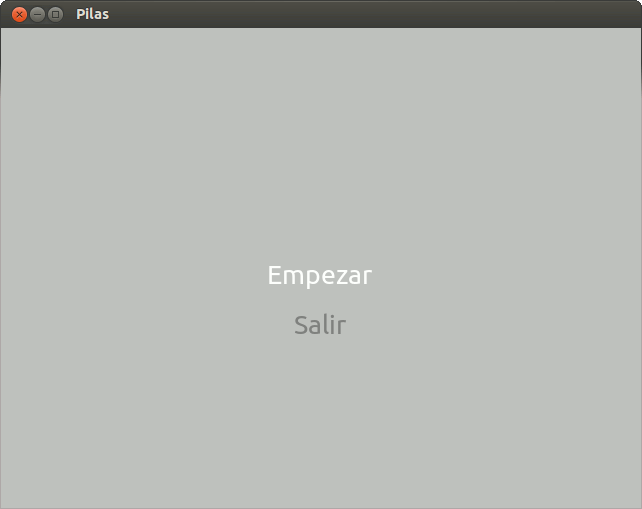
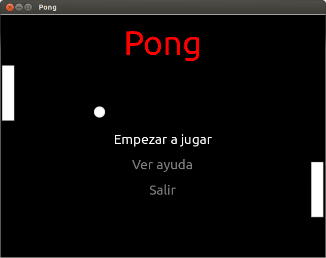

================
Menú de opciones
================

.. note:: **En un juego es fundamental un menú de opciones** (para jugar, salir, consultar los controles, etc.), es por eso que pilas tiene destinado un actor "Menu()" (el que vamos a usar).

.. warning:: Es importante que sepan no hace falta que el juego salga exactamente igual al del tutorial, es más, si le quieren hacer modificaciones porque algo no les gusta háganlo, eso les va a ayudar a conocer más sobre pilas y a personalizar el juego.

Bueno, para generar un menú hay que pasarle una lista de opciones; en nuestro caso serán "Empezar juego", "Ver controles" y "Salir". Pero también se deben definir funciones que nos dirán que pasará al seleccionar esa opción. Por ejemplo:

.. code-block:: python
    :linenos:
    
    import pilas         # importa la librería pilas

    pilas.iniciar()      # inicia la ventana

    def selecciona_empezar():   # función que se ejecutará al seleccionar Empezar
        pilas.avisar('Ha seleccionado "Empezar"') # muestra en pantalla que se ha seleccionado Empezar

    def selecciona_salir():   # función que se ejecutará al seleccionar Salir
        pilas.avisar('Ha seleccionado "Salir"') # muestra en pantalla que se ha seleccionado Salir

    opciones = [('Empezar', selecciona_empezar),  # relaciona el texto "Empezar" con su función selecciona_empezar
                ('Salir', selecciona_salir)]      # relaciona el texto "Salir" con su función selecciona_salir

    menu = pilas.actores.Menu(opciones)    # creás un actor "menu" de tipo "Menu()"; y le pasás las opciones como parámetro

    pilas.ejecutar()      # ejecuta las líneas escritas anteriormente
    
Como hay muchas cosas nuevas, vamos a ver paso a paso lo que hicimos:

#. Primero importamos pilas.

#. Luego abrimos una ventana.

#. Definimos la función "**selecciona_empezar**":

    * "``pilas.avisar('Ha seleccionado "Empezar"')``" genera un texto que aparecerá abajo y a la izquierda de nuestra ventana. En este caso: 'Ha seleccionado "Empezar"'.

#. Definimos la función "**selecciona_salir**":

    * "``pilas.avisar('Ha seleccionado "Salir"')``" genera un texto que aparecerá abajo y a la izquierda de nuestra ventana. En este caso: 'Ha seleccionado "Salir"'.

#. Generamos una variable "opciones" en donde vamos a listar todas las opciones de nuestro menú junto con el nombre de la función que se ejecutará al hacerle click.

#. Creamos una variable "menu" donde le asignamos el actor "pilas.actores.Menu(opciones)". Éste actor tiene la particularidad de recibir como único parámetro una lista (la del punto anterior, "opciones"), donde estarán todas las opciones posibles.

#. Y por último ponemos "pilas.ejecutar()". Ésta última línea solo se pone cuando escribimos el código en un archivo para ejecutarlo, en la consola interactiva no hace falta.

Nos debería quedar algo así:

    
Para que el menú se vea mejor, podríamos ponerle un fondo y un título:

    
Para poner el fondo (que se lo pueden bajar de acá o cambiarlo), recordamos:

.. code-block:: python
    :linenos:
    
    fondo = pilas.fondos.Fondo('pilas-fondo-final.png')      # esta función toma la ruta de una imagen y la usa de fondo

Y para el título (lo pueden bajar de acá o cambiarlo), se puede generar un actor con esa imágen, así:

.. code-block:: python
    :linenos:
    
    titulo = pilas.actores.Actor('pilas-titulo-final.png')      # esta función toma la ruta de una imagen y la usa de actor
