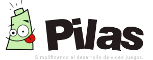

.. Tutorial Pong-C&A documentation master file, created by
   sphinx-quickstart on Wed Oct 10 23:18:07 2012.
   You can adapt this file completely to your liking, but it should at least
   contain the root `toctree` directive.

¿Cómo hacer un Pong?
====================

</head>

<body link="red" vlink="red" alink="red">
  

<h3>Ping Pong en HTML5 v0.1</h3>
<canvas id="stage" width="600" height="300" onClick="init();" >
Por favor, utiliza Firefox, Chrome, Safari u Opera.
</canvas>

      

        Jugador A:
        <b>0</b>

        Jugador B:
        <b>0</b> 
      

**"Programando con pilas-engine"**

        

Índice:
-------

.. toctree::
    :maxdepth: 2

    data/Introduccion.rst
    data/ActoresYfondos.rst
    data/MenuOpciones.rst
    data/EscenasMenuControles.rst
    data/EscenaJuego.rst
